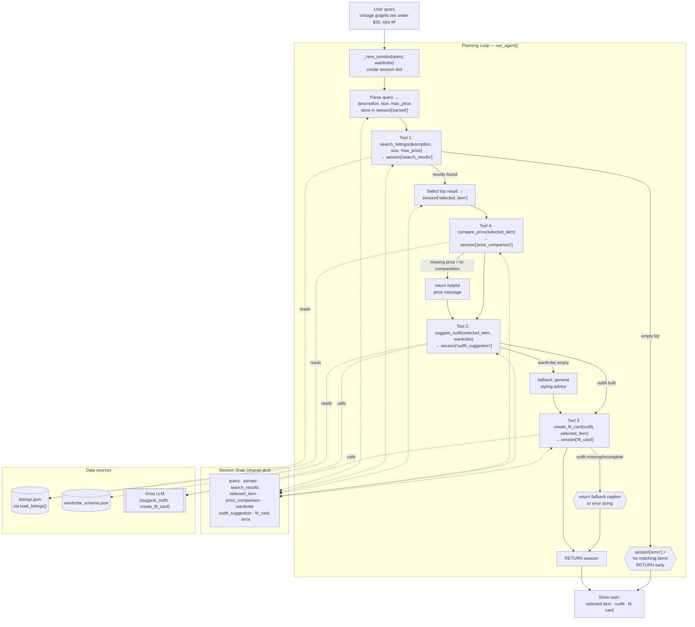

# FitFindr — planning.md

> Complete this document before writing any implementation code.
> Your spec and agent diagram are what you'll use to direct AI tools (Claude, Copilot, etc.) to generate your implementation — the more specific they are, the more useful the generated code will be.
> Your planning.md will be reviewed as part of your submission.
> Update it before starting any stretch features.

---

## Tools

List every tool your agent will use. For each tool, fill in all four fields.
You must have at least 3 tools. The three required tools are listed — add any additional tools below them.

### Tool 1: search_listings

**What it does:**
This tool searches through `listings.json` and returns clothing listings that match the user's description, size, and maximum price.


**Input parameters:**
<!-- List each parameter, its type, and what it represents -->
- `description` (str): The style user is looking for such as vintage graphic tee or athletic track jacket.
- `size` (str): The clothing size user is looking for such XS, S, M etc
- `max_price` (float): The maximum amount user is willing to pay for the item.

**What it returns:**
A list of matching clothing listings. Each listing contains information such as:
- id
- title
- description
- category
- style_tags
- size
- condition
- price
- colors
- brand
- platform

**What happens if it fails or returns nothing:**
If no listings match user's request, then the tool returns empty list and inform the user that no items were found. Then the agent can ask the user to try different preference.

---

### Tool 2: suggest_outfit

**What it does:**
This tool takes the selected clothing item from `search_listings` and the user's wardrobe from `wardrobe_schema.json`, then suggests one or more complete outfit combinations.

**Input parameters:**
<!-- List each parameter, its type, and what it represents -->
- `new_item` (dict): The selected listing from `listings.json`. It contains fields such as `id`, `title`, `description`, `category`, `style_tags`, `size`, `condition`, `price`, `colors`, `brand`, and `platform`.

- `wardrobe` (dict): The user's closet from wardrobe_schema.json, containing an items list.

**What it returns:**
A string containing one or more outfit suggestions that use the new item and matching wardrobe pieces, with a short reason why they work together.

**What happens if it fails or returns nothing:**
If the wardrobe is empty or has no good matches, the tool returns a fallback outfit idea using the new item and suggests what type of piece the user may need.

---

### Tool 3: create_fit_card

**What it does:**
This tool generates a short and casual description of the outfit that can shared to Instagram. It'll produce different description based on the outfit.

**Input parameters:**
<!-- List each parameter, its type, and what it represents -->
- `outfit` (str): The outfit suggestion string created by suggest_outfit, including the new item, matching wardrobe pieces, and style explanation.
- `new_item` (dict): The selected listing from `listings.json`, used so the caption can mention the item name, price, and platform.

**What it returns:**
A short caption-style string describing the complete outfit.

**What happens if it fails or returns nothing:**
If the outfit data is incomplete, the tool creates a simple fallback caption using the new item and any available outfit details. If both the outfit and new item are missing, the agent tells the user it could not create a fit card and shows the outfit suggestion instead.

---

### Additional Tools (if any)

<!-- Copy the block above for any tools beyond the required three -->

### Tool 4: compare_price

**What it does:**
This tool compares the selected item's price against similar listings (same category and overlapping style tags) so the user knows whether the find is worth it.

**Input parameters:**
- `new_item` (dict): The selected listing from `search_listings`. It contains fields such as `id`, `title`, `description`, `category`, `style_tags`, `size`, `condition`, `price`, `colors`, `brand`, and `platform`.

**What it returns:**
A short string saying whether the price is a **good deal**, a **fair price**, or **overpriced**, along with the item's price and the average price of the comparable listings it found.

**What happens if it fails or returns nothing:**
If the item has no price, or not enough similar listings are found to judge fairly, the tool returns a helpful message (e.g., "Not enough similar listings were found to judge the price fairly.") instead of crashing, and the agent continues the flow.

---

## Planning Loop

The agent first reads the user's request and extracts `description`, `size`, and `max_price`. Then it calls `search_listings(description, size, max_price)`. If no listings are found, the agent tells the user no matching items were found and asks them to try a different style, size, or price.

If listings are found, the agent stores the best result as `new_item` / `selected_item` and calls `compare_price(new_item)`. The result is stored as `price_comparison`. The agent then calls `suggest_outfit(new_item, wardrobe)`. If the wardrobe is empty, `suggest_outfit` returns a fallback outfit idea using the new item. If an outfit is created, the agent stores it as `outfit` and calls `create_fit_card(outfit, new_item)`.

The loop ends when the agent has a selected listing, an outfit suggestion, and a fit card to show the user.


---

## State Management

**How does information from one tool get passed to the next?**

The agent stores tool results in session state so the next tool can use them. After `search_listings` finds results, the best item is saved as `new_item`. That item is passed into `compare_price(new_item)`, whose result is stored as `price_comparison`. Then `new_item` is passed into `suggest_outfit(new_item, wardrobe)`. After an outfit is created, it is saved as `outfit` and passed into `create_fit_card(outfit, new_item)`.

The main data tracked is `new_item`, `price_comparison`, `wardrobe`, `outfit`, and `fit_card`.


---

## Error Handling

For each tool, describe the specific failure mode you're handling and what the agent does in response.

| Tool | Failure mode | Agent response |
|------|-------------|----------------|
| search_listings | No results match the query | Tell the user no matching items were found and ask them to try a different style, size, or price. |
| compare_price | Missing price or not enough comparable listings | Return a helpful price comparison message instead of crashing and continue the flow. |
| suggest_outfit | Wardrobe is empty or minimal | Return a fallback outfit idea using the new item and suggest what piece could complete the outfit. |
| create_fit_card | Outfit input is missing or minimal | Create a simple caption using the available item/outfit details, or tell the user a fit card could not be created. |

---

## Architecture

The agent is a **single planning loop** (`run_agent` in `agent.py`) that drives the
three required tools plus the additional `compare_price` tool in a fixed sequence.
Every tool reads from and writes to one shared **session dict**, which is the single
source of truth for the run. Two error paths branch off and end the interaction early.

**Tool 4 placement:** `compare_price(selected_item)` runs right after `selected_item`
is chosen and before `suggest_outfit`. Its result is stored in
`session['price_comparison']`. Because it sits after the no-results early return, it
only runs when a listing was actually found.



### ASCII fallback

```
  User query
      │
      ▼
  parse query (description, size, max_price)
      │
      ▼
  search_listings ──► empty? ──► "no items found" (RETURN)
      │
      ▼ select top item
  compare_price ──► missing price / no comparables? ──► helpful price message
      │
      ▼
  suggest_outfit ──► empty wardrobe? ──► fallback advice
      │
      ▼
  create_fit_card ──► incomplete? ──► fallback caption
      │
      ▼
  RETURN ──► item + price check + outfit + fit card

  Flow: search_listings → selected_item → compare_price → suggest_outfit → create_fit_card

  Session state (shared dict): query · parsed · search_results ·
  selected_item · price_comparison · wardrobe · outfit_suggestion · fit_card · error
  (every step reads/writes this dict)

  Data sources: listings.json ─► search_listings, compare_price
                wardrobe_schema.json + Groq LLM ─► suggest_outfit
                Groq LLM ─► create_fit_card
```

---

## AI Tool Plan

I will use ChatGPT to help me understand and refine the tool logic, planning loop, state management, and error handling from `planning.md`. I expect ChatGPT to help explain the logic clearly so I can implement it correctly.

I will use Claude Code for implementation support by giving it my tool specs, error handling table, state management section, and architecture diagram. I expect Claude Code to help implement the required functions and connect them through the agent workflow.

I will verify the output by testing each tool separately: `search_listings` with matching and no-match queries, `suggest_outfit` with a normal wardrobe and an empty wardrobe, and `create_fit_card` with complete and incomplete outfit data. After that, I will test the full flow from user request to final fit card.

**Milestone 3 — Individual tool implementations:**

**Milestone 4 — Planning loop and state management:**

---

## A Complete Interaction (Step by Step)

Write out what a full user interaction looks like from start to finish — tool call by tool call. Use a specific example query.

**Example user query:** "I'm looking for a vintage graphic tee under $30. I mostly wear baggy jeans and chunky sneakers. What's out there and how would I style it?"

**Step 1:**
<!-- What does the agent do first? Which tool is called? With what input? -->

First, the agent reads the user's query and extract description, size and max price. In this case it'll extract vintage graphic tee and max price of $30. Then it'll call search_listings(description, size, max_price). This tool searches through `listings.json` and returns clothing listings that match the user's description, size, and maximum price. If no listing is found then it'll let the user know that no matching items were found and ask them to try a different style, size, or price.


**Step 2:**
<!-- What happens next? What was returned from step 1? What tool is called now? -->

After step 1 search_listings will list of matching clothing listings. Each listing contains information such as: id, title, description, category, style_tags, size, condition, price, colors, brand and platform. After `search_listings` finds results, the best item is saved as `new_item`. Then it is passed into suggest_outfit(new_item, wardrobe). After looking through new_item and user's wardrobe the tool recommends one or more complete outfit combinations. It essentially returns a string with one or more outfit suggestions using the new item and matching wardrobe pieces, with a short reason why they work together. If wardrobe is empty or minimal then it handles the error by returning a fallback outfit idea using the new item and suggest what piece could complete the outfit.


**Step 3:**
<!-- Continue until the full interaction is complete -->

After step 2 the new outfit combination is stored inside of parameter outfit and calls create_fit_card(outfit, new_item). This tool generates a short and casual description of the outfit that can be used as an instagram caption. It produces different description based on different outfits. If no new outfit is found then a simple caption will be created using the available item/outfit details, or the program will tell the user a fit card could not be created.


**Final output to user:**
<!-- What does the user actually see at the end? -->

Selected Item:
Graphic Tee - 2003 Tour Bootleg Style

Price: $24.00

Size: L

Condition: Good

Platform: Depop

Price Check:
Price check: good deal.
This item is $24.00. Similar listings average around $31.50, based on 4 comparable item(s).

Suggested Outfit:
- Graphic Tee - 2003 Tour Bootleg Style
- Baggy blue jeans (from wardrobe)
- White chunky sneakers (from wardrobe)

Why it works:
The vintage bootleg graphic tee pairs naturally with relaxed denim and chunky sneakers, creating a casual streetwear-inspired outfit.

Fit Card:
"Vintage graphics, baggy denim, and clean sneakers. A timeless streetwear combo that always works."
